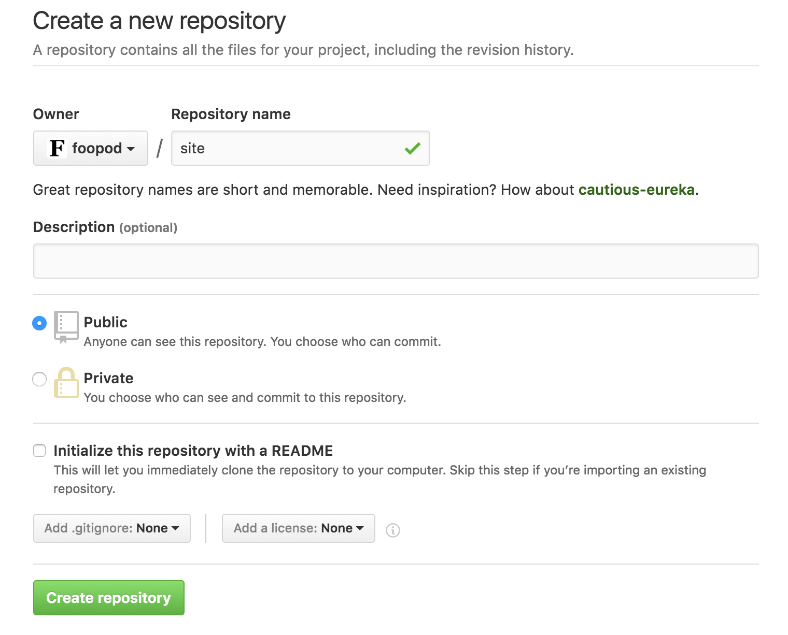
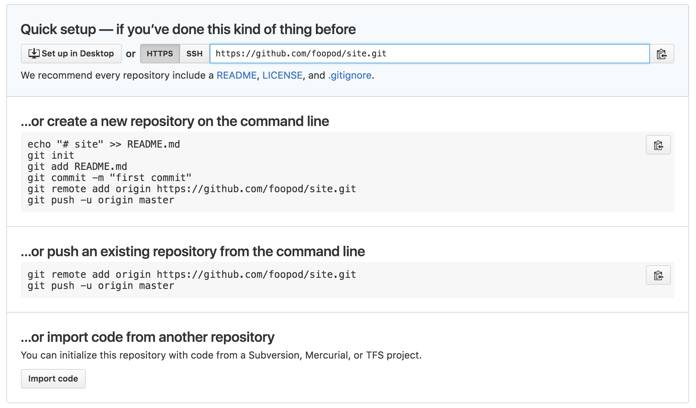
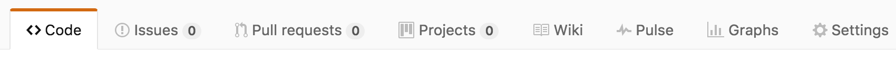
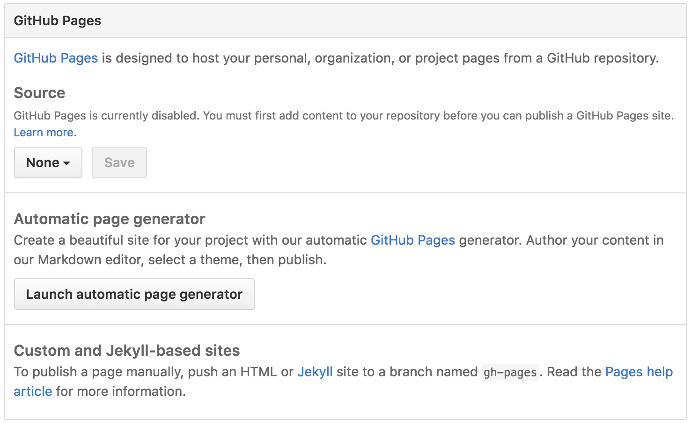

#Setting up your first website on Github

#Requirements
+ Git (preinstalled on Mac)
+ An email address

##Make a Github Account

Go to [http://github.com](http://github.com) and create an account. You will need to verify your account using your email address.

##Making your first repository

Go to [https://github.com/new](https://github.com/new) or click the New Repository button. Enter a repository name since we are making a website I named my repository `site`.



Done! Now you have your own repository. 



Now that your repo exist on Github you can clone it on your computer. You can do this by taking the link from this page. In my case `https://github.com/foopod/site.git`.

Open up Terminal (Mac or Linux) or your Git Shell (Windows).

`foo$ git clone https://github.com/foopod/site.git`

This will clone your repo to your computer.

```
foo$ git clone https://github.com/foopod/site.git
Cloning into 'site'...
warning: You appear to have cloned an empty repository.
Checking connectivity... done.
```

##Setting up your first HTML Page

Now to make your first page.

Make a file in your site folder (this is your repository) named `index.html`.

And put the below code into it and save it (this will be the skeleton of your page).

```
<html>
    <head>
        <title>Website</title>
    </head>
    <body>
        <h1>Hellow World!</h1>
    </body>
</html>
```

##Committing your first code

Now that you have made changes in your repository you will want them to also be reflected in Github.

You can do that by running the following commands from your repository folder.

`foo$ git add index.html` - So that Git knows that it add the file to the next commit

`foo$ git commit -m "Add index.html"` - Committing your files. Note that -m is to add a message so you can easily keep track of the changes that you made.

`foo$ git push` - Pushes all your changes to Github.

The command line will let you know everything was successful with an output that looks something like this...

```
Counting objects: 5, done.
Delta compression using up to 4 threads.
Compressing objects: 100% (5/5), done.
Writing objects: 100% (5/5), 193.80 KiB | 0 bytes/s, done.
Total 5 (delta 0), reused 0 (delta 0)
To https://github.com/foopod/site.git
   068a887..4cafc5c  master -> master
```

##Setting up Github Pages (Putting your site online)

Back in Github. Go to your repository and click on the settings button.



Scroll down to the Github pages section an change the sources from `None` to the `Master branch`.



